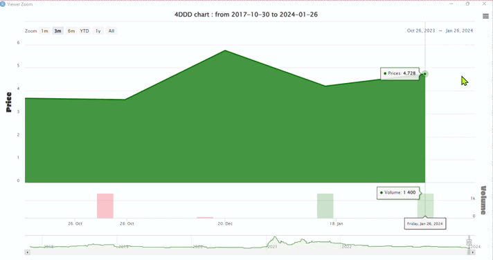
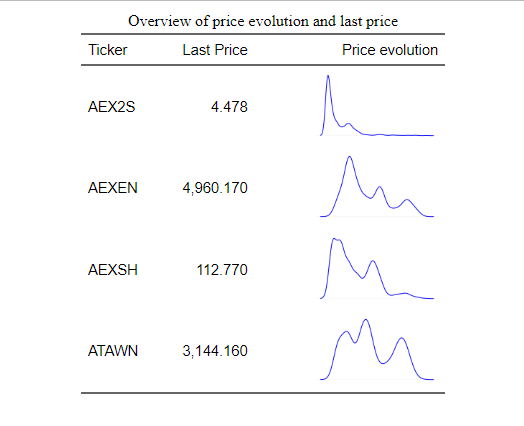
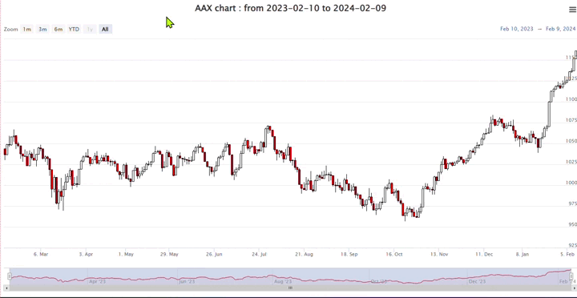
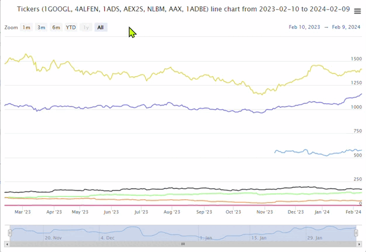
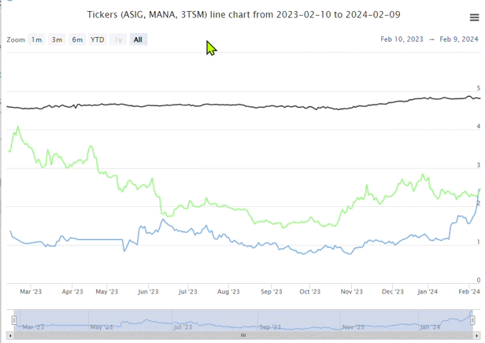

```{r,include = FALSE}
knitr::opts_chunk$set(
  collapse = TRUE,
  comment = "#>",
  fig.path = "man/figures/README-",
  out.width = "100%",
  echo = TRUE,
  message = FALSE,
  warning = FALSE
)
```

<!--  -->
<!--  -->


<!--  -->
<!--  -->


<!--  -->


## Overview {.tabset}
# Description:
Unlock the power of financial data from the Euronext stock exchange with the Euronext R package. Dive into the world of stocks, indices, funds, ETFs, and bonds, and harness the convenience of a user-friendly interface for seamless data retrieval. Whether you're a researcher, investor, or financial enthusiast, this package provides a valuable resource for accessing and analyzing historical data, share prices, trading volumes, and more.

# Disclaimer:
Please note that the Euronext R package is a tool designed to access and retrieve public financial information from the Euronext stock exchange. The data returned by the Euronext R package originates from Euronext, and the package author is not the source of this data. All information is derived from the public domain, and users are advised to refer to the official [Euronext website](https://live.euronext.com/en) for specific data needs.

# Get in touch with the Euronext package and elevate your understanding of financial markets through the lens of R.


### Description {.tabset}
#### English

The Euronext R Package is a powerful tool for accessing and retrieving financial information from the Euronext stock exchange. Whether you are interested in stocks, indexes, funds, ETFs, or bonds, this package provides a convenient interface to gather essential data for analysis and decision-making in the financial domain. With user-friendly functionalities, it simplifies the process of collecting historical data on share prices, trading volumes, and other financial indicators. Researchers, investors, and other users can extract valuable insights and make informed decisions based on the comprehensive information available. In essence, the 'Euronext' library is a valuable asset for those seeking a deeper understanding of Euronext and the financial markets in Europe.

#### Français
Le package R Euronext est un outil puissant pour accéder et récupérer des informations financières de la bourse Euronext. Que vous soyez intéressé par les actions, les indices, les fonds, les ETF ou les obligations, ce package offre une interface pratique pour collecter des données essentielles pour l'analyse et la prise de décision dans le domaine financier. Avec des fonctionnalités conviviales, il simplifie le processus de collecte de données historiques sur les prix des actions, les volumes de transactions et d'autres indicateurs financiers. Les chercheurs, les investisseurs et d'autres utilisateurs peuvent extraire des informations précieuses et prendre des décisions éclairées en se basant sur les informations complètes disponibles. En somme, la bibliothèque 'Euronext' est un atout précieux pour ceux qui cherchent à approfondir leur compréhension d'Euronext et des marchés financiers en Europe.

## Html version of the Readme Since the size of the readme is huge due to the charts, you can visit the html version of the readme on [RPubs](https://rpubs.com/Fredysessie/euronext)

## Installation {.tabset}

## Installation guidelines
You can install the development version of EURONEXT from [github](https://github.com/Fredysessie/Euronext) with:

```{r, echo=FALSE, message=TRUE, warning=TRUE,include=FALSE}
library(Euronext)
library(lubridate)
library(DT)
library(httr2)       
library(stringr)     
library(httr)        
library(timeDate)    
library(xts)        
library(rlang)      
library(dplyr)      
library(formattable)
library(rvest)      
library(highcharter)
library(htmlwidgets)
library(flextable)
library(grDevices)
library(knitr)
library(kableExtra)
```


```{r, eval=FALSE}
# github dev version
## We can use devtools
# Install the development version from GitHub
devtools::install_github("Fredysessie/Euronext")

# Or use remotes
# install.packages("remotes")

remotes::install_github("Fredysessie/Euronext")
```

## **EN_GetProfile()** function

To better utilize the various functions of the 'Euronext' package, it is crucial to provide accurate information (such as ticker Name, ISIN, Symbol, or DNA) to the functions.

This function retrieves the profile of a given ticker - Equity, Index, Fund, ETF, or Bond - listed on the Euronext exchange based on its ticker Name, ISIN, Symbol, or DNA. It returns a list with details such as Name, ISIN, Symbol, and DNA information. It receives two (2) parameters:
- 'ticker' : A character string representing the company's ticker Name, ISIN, Symbol or DNA,
- 'stock_type' : The type of the ticker: 'Eq_Ind' for Stocks and Indexes, 'Fund' or "F" for Fund tickers, 'Bond' or "B" for Bond tickers, and 'Etfs' or "E" for EFTs.


### *Example 1.a* : Retrieve the *profile* (*characteristics*) of a specified Equity, Index, Fund, ETF, or Bond listed on Euronext.


Please refer to the respective functions **EN_GetISIN()**, **EN_GetISIN_Etf()**, **EN_GetISIN_F()**, and **EN_GetISIN_B()** if you wish to obtain the DNA of a giving Equity or Index, ETF, Fund, and Bond listed on Euronext (retrieving DNA is useful in case you decide to use 'escape = TRUE' option).


```{r EN_GetProfile, eval=TRUE}
# Note: For Equity, Index, Fund, and ETF, provide the giving Symbol, ISIN, Name, or DNA for best results, but for a Bond, provide its DNA and sometimes its Name for best results because a company or country can issue more than one Bond.

 ## Equities
 # Example a : '3D SYSTEMS CORP' equity
 EN_GetProfile("4ddd")  # By providing Symbol

 # Example b : 'ALFEN' equity
 EN_GetProfile("NL0012817175") # By providing ISIN

 # Example c : 'LES HOTELS BAVEREZ' equity
 EN_GetProfile("LES HOTELS BAVEREZ") # By providing Name
 
 # Example d : 'BE SEMICONDUCTOR' equity
 EN_GetProfile("NL0012866412-XAMS") # By providing DNA
 
 ## Indices 
 # Example a : 'AEX CONS STAPL GR' Index
 EN_GetProfile("NLCSG") # By providing Symbol
 
 # Example b : 'AEX All-Share Index' Index
 EN_GetProfile("NL0000249100") # By providing ISIN

 # Example c : 'Euronext Core Europe 30 EW Decrement 5% NR' Index
 EN_GetProfile("EN CE EW30 D 5% NR") # By providing Name
 
 # Example d : 'SBF 120 NR' Index
 EN_GetProfile("QS0011131842-XPAR") # By providing DNA
 
 ## ETFs 
 # Example a : 'Asia IG Corp US A' Etf
 EN_GetProfile("$Asia IG Corp US A", stock_type = 'E') # By providing Name
 
 # Example b : '1X MSFT' Etf
 EN_GetProfile("MSFT", stock_type = 'E') # By providing Symbol
 
 # Example c : '3X LONG COINBASE' Etf
 EN_GetProfile("XS2399367254", stock_type = 'E') # By providing ISIN of 3X LONG COINBASE
 
 # Example d : '3X PLTR' Etf
 EN_GetProfile("XS2663694680-XAMS", stock_type = 'E') # By providing DNA

 # Funds
 # Example a : 'ACOMEA PERFORMANCE' Fund
 EN_GetProfile("ACAPER", stock_type = 'F') # By providing Symbol
 
 # Example b : 'BNP ESGNL' Fund
 EN_GetProfile("BNP ESGNL", stock_type = 'F') # By providing Name
 
 # Example c : 'SWIF2' Fund
 EN_GetProfile("NL0015000W40", stock_type = 'F') # By providing ISIN of SWIF2

 # Example d : 'GOLDMAN SACHS PARAPLUFONDS 2 N' Fund
 EN_GetProfile("NL0000293181-XAMS", stock_type = 'F') # By providing DNA of GSDM5

 # Examples for Bonds
 # Example a: 'A2A SLB TF 0,625%' Bond
 EN_GetProfile("XS2364001078-XMOT", stock_type = 'B') # By providing DNA

 # Example b: 'AAB1.50%30SEP30' Bond
 EN_GetProfile("AAB1.50%30SEP30", stock_type = 'B') # By providing Name

```

## **EN_Get_News()** function
This function retrieves the update information of a company listed on the Euronext exchange
based on its ticker symbol. It returns a table with details such as its real Name, ISIN,
Last traded Price, Date of last update, and other relevant informations.

*Inputs* :
- *ticker* A character string representing the company's ticker, name, or ISIN.
- *stock_type*   The type of the ticker: 'Eq_Ind' for Stocks and Indexes, 'Fund' or "F" for Fund tickers,'Bond' or "B" for Bond tickers, and 'Etfs' or "E" for EFTs.
- *escape* Boolean, either TRUE or FALSE. If escape is True, it means you're providing the DNA
(ISIN-Market identifier) directly. Giving T to escape is helpful to avoid time-consuming
operations; otherwise, F means you need to provide the Ticker symbol, name, or ISIN
and the type of market to which it belongs.


### *Example 1.b* : Get Latest News for an Equity
```{r EN_Get_News, eval=FALSE}
# Retrieve news for the equity "AALBERTS N.V." using its DNA
equity_news <- EN_Get_News("NL0000852564-XAMS", escape = TRUE)
print(equity_news)
```


```{r echo=FALSE}
# Retrieve news for the equity "AALBERTS N.V." using its DNA
equity_news <- EN_Get_News("NL0000852564-XAMS", escape = TRUE)

kable(equity_news, "html") %>%
  kable_styling(bootstrap_options = "striped")

```


### *Example 1.c* : Get Latest News for an Index
```{r eval=FALSE}
# Retrieve news for the index "AEX All-Share Index GR" using its symbol
index_news <- EN_Get_News("QS0011224977-XAMS", escape = TRUE)
print(index_news)
```


```{r echo=FALSE}
# Retrieve news for the index "AEX All-Share Index GR" using its symbol
index_news <- EN_Get_News("QS0011224977-XAMS", escape = TRUE)
kable(index_news, "html") %>%
  kable_styling(bootstrap_options = "striped")

```


### *Example 1.d* : Get Latest News for a Bond
```{r eval=FALSE}
# Retrieve news for the bond "AAB0.45%12DEC2036" using its DNA
bond_news <- EN_Get_News("XS2093705064-XAMS", escape = TRUE)
print(bond_news)

```


```{r echo=FALSE}
bond_news <- EN_Get_News("XS2093705064-XAMS", escape = TRUE)
kable(bond_news, "html") %>%
  kable_styling(bootstrap_options = "striped")

```

## **EN_Stocks_List()** function

This function receives as input **stock_choice** and then retrieves a list of companies listed on the provided Euronext stock exchanges, filtered by the initial letter of their names. It provides information such as the company name, ticker symbol, ISIN code, market, last closing price, percentage change, and a link to the company's details on the Euronext website.
- stock_choice A character string specifying the stock exchange. Options include "A" or "Amsterdam," "B" or "Brussels," "D" or "Dublin", "L" or "Lisbon," "M" or "Milan," "P" or "Paris," and "O" or "Oslo."


### *Example 2.a* : Get Euronext Stocks List

```{r EN_Stocks_List, eval=FALSE}
# The columns names of the initial dataframe is c("Date", "Name", "Ticker", "Code_ISIN", "Market", "Last_price", "Percentage change (in %)", "URL", "Ticker_adn")

# So I will only display columns "Name", "Ticker", "Code_ISIN", "Market", "Last_price" and "Percentage change (in %)"

# For Amsterdam Stock
a_result_df <- EN_Stocks_List("A")
head(a_result_df)[,c(2:6)]

```

```{r echo=FALSE}
library(knitr)
library(kableExtra)
a_result_df <- EN_Stocks_List("A")   # For Amsterdam Stock
a_result_df.h <- head(a_result_df)[,c(2:6)]

kable(a_result_df.h, "html") %>%
  kable_styling(bootstrap_options = "striped")

```


```{r eval=FALSE}
# For Brussels Stock
b_result_df <- EN_Stocks_List("B")[,c(2:6)]
tail(b_result_df)
```


```{r echo=FALSE}
# library(knitr)
# library(kableExtra)
b_result_df <- EN_Stocks_List("B")[,c(2:6)]  # For Brussels Stock
b_result_df.t <- tail(b_result_df)

kable(b_result_df.t, "html") %>%
  kable_styling(bootstrap_options = "striped")

```


```{r eval=FALSE}
# For Paris Stock
p_result_df <- EN_Stocks_List("P")[,c(2:6)]
head(p_result_df)

```


```{r echo=FALSE}
p_result_df <- EN_Stocks_List("P")[,c(2:6)]  # For Paris Stock
p_result_df.h <-head(p_result_df)

kable(p_result_df.h, "html") %>%
  kable_styling(bootstrap_options = "striped")

```


```{r eval=FALSE}
# For Lisbon Stock
l_result_df <- EN_Stocks_List("L")[,c(2:6)]  
head(l_result_df)

```


```{r echo=FALSE}
l_result_df <- EN_Stocks_List("L")[,c(2:6)]  # For Lisbon Stock
l_result_df.h <- head(l_result_df)

kable(l_result_df.h, "html") %>%
  kable_styling(bootstrap_options = "striped")

```


```{r eval=FALSE}
# For Milan Stock
m_result_df <- EN_Stocks_List("M")[,c(2:6)]  # For Milan Stock
tail(m_result_df)
```


```{r echo=FALSE}
# library(knitr)
# library(kableExtra)
m_result_df <- EN_Stocks_List("M")[,c(2:6)]  # For Milan Stock
m_result_df.t <- tail(m_result_df)
kable(m_result_df.t , "html") %>%
  kable_styling(bootstrap_options = "striped")

```


```{r eval=FALSE}
# For Dublin Stock
d_result_df <- EN_Stocks_List("D")[,c(2:6)]  
tail(d_result_df)

```


```{r echo=FALSE}
# library(knitr)
# library(kableExtra)
d_result_df <- EN_Stocks_List("D")[,c(2:6)]  # For Dublin Stock
d_result_df.t <- tail(d_result_df)
kable(d_result_df.t, "html") %>%
  kable_styling(bootstrap_options = "striped")

```


```{r eval=FALSE}
# For Oslo Stock
o_result_df <- EN_Stocks_List("O")[,c(2:6)]
head(o_result_df, 10)

```


```{r echo=FALSE}
library(knitr)
library(kableExtra)
o_result_df <- EN_Stocks_List("O")[,c(2:6)]  # For Oslo Stock
o_result_df.h <- head(o_result_df, 10)
kable(a_result_df.h, "html") %>%
  kable_styling(bootstrap_options = "striped")

```


### *Example 2.b* : Euronext Paris ticker ISIN
```{r EN_P_Ticker_adn, eval=TRUE}
# Retrieve the ISIN for a company with ticker "abca"
EN_P_Ticker_adn("abca")

# Example result for a valid ticker "AAA"
result <- EN_P_Ticker_adn("AAA")
print(result)

# Example for a non-existing ticker "afsf"
print(EN_P_Ticker_adn("afsf"))  # Ticker is not existing
```


### *Example 2.c* : Show in detail Paris Euronext Stocks

```{r , eval=TRUE,  echo = FALSE}
library(Euronext)
p_result_df_new <- EN_Stocks_List("P")

# p_result_df_new$Date <- strptime(p_result_df_new$Date, format = "%d %b %Y")
# as.Date(strptime(head(a_result_df$Date), format = "%d %b %Y"))

clm_format = list(list(targets = c(0, 2:8), className = "dt-center"))

datatable(p_result_df_new[c(2:9, 1)], escape = FALSE, 
          # filter = 'top',
          rownames = FALSE,
          extensions = list('ColReorder' = NULL, 'RowReorder' = NULL,
                            'Buttons' = NULL, 'Responsive' = NULL),
          options = list(dom = 'BRrltpi', scrollX = TRUE, scrollY = '350px', # ajustez la hauteur en fonction de vos besoins
                         lengthMenu = list(c(10, 50, 100, -1), c('10', '50', '100', 'All'))
                         ,
                         ColReorder = TRUE, rowReorder = FALSE,
                         buttons = list('copy', 'print',
                                        list(extend = 'collection',
                                             buttons = c('csv', 'excel', 'pdf'),
                                             columnDefs = clm_format,
                                             text = 'Download'), I('colvis'))
          ))


```


## **EN_Indices_List()** function
It receives no argument and retrieves information about all indices available on Euronext. 


### *Example 3* : Get the list of Euronext Indexes
```{r EN_Indices_List, eval=FALSE}
# Get list of Indices available on Euronext
all_indices = EN_Indices_List()
dim(all_indices)
tail(all_indices)
```


```{r echo=FALSE}
all_indices = EN_Indices_List()
all_indices.t = tail(all_indices)

dim(all_indices)

kable(all_indices.t, "html") %>%
  kable_styling(bootstrap_options = "striped")
```


## **EN_Etfs_List()** and **EN_Etfs_List_bis** functions

*EN_Etfs_List* receives as input **tot_page** which is the total number of pages to retrieve. 
In contrast, *EN_Etfs_List_bis* receives as input **target_page** which represents the target page.
For example, the function **EN_Etfs_List_bis(5)**, retrieves only the fifth page of the Etfs list, allowing more granular control of the data retrieval process (ordered list of 100 Etfs), whereas **EN_Etfs_List(5)** would return an ordered list of 500 Etfs listed on Euronext (on each page there are 100 Etfs, so for 5 pages 5*100 = 500).


### **Example 4 : Get the list of ETFs** quoted on Euronext markets

```{r EN_Etfs_List, eval=FALSE}
# Get 1st 500 Etfs in alphabetic order
dt_ <- EN_Etfs_List()
tail(dt_[, c(2:9)])

# The number of columns and rows
dim(dt_)

```


```{r echo=FALSE}
# Get 1st 500 Etfs in alphabetic order
dt_ <- EN_Etfs_List()
dt_t <- tail(dt_[, c(2:9)])

# The number of columns and rows
# print('Dimension of the dataframe')

kable(dt_t, "html") %>%
    kable_styling(bootstrap_options = "striped")

dim(dt_)

```


```{r eval=FALSE}
# By default, EN_Etfs_List_bis() returns the list of 100 Etfs in alphabetic order
dt_1 <- EN_Etfs_List_bis()  
# The number of columns and rows
dim(dt_1)
# Head
dt_1.h <- head(dt_1[, c(2:9)])

```


```{r echo=FALSE}
dt_1 <- EN_Etfs_List_bis() #By default returns the list of 100 Etfs in alphabetic order 
# The number of columns and rows
dim(dt_1)
# Head
dt_1.h <- head(dt_1[, c(2:9)])

kable(dt_1.h, "html") %>%
    kable_styling(bootstrap_options = "striped")

```


## **EN_Bonds_List()** and **EN_Bonds_List_bis** functions

*EN_Bonds_List* receives as input **tot_page** which is the total number of pages to retrieve. 
In contrast, *EN_Bonds_List_bis* receives as input **target_page** which represents the target page.
For example, the function **EN_Bonds_List_bis(5)**, retrieves only the fifth page of the Bonds list, allowing more granular control of the data retrieval process (ordered list of 100 Bonds), whereas **EN_Bonds_List(5)** would return an ordered list of 500 Bonds listed on Euronext (on each page there are 100 Bonds, so for 5 pages 5*100 = 500).


### **Example 5 : Get the list of Bonds** quoted on Euronext markets

```{r EN_Bonds_List, EN_Bonds_List_bis, eval=FALSE}
# Get 1st 500 Bonds in alphabetic order
dt_b <- EN_Bonds_List()
head(dt_b[, c(2:9)])

tail(dt_b[, c(2:9)])


```


```{r  echo=FALSE}
# Get 1st 500 Bonds in alphabetic order
dt_b <- EN_Bonds_List()
dt_b.h <- head(dt_b[, c(2:9)])

dt_b.t <- tail(dt_b[, c(2:9)])

kable(dt_b.h, "html") %>%
    kable_styling(bootstrap_options = "striped")

kable(dt_b.t, "html") %>%
    kable_styling(bootstrap_options = "striped")
```


```{r  eval=FALSE}
dt_b1 <- EN_Bonds_List_bis() #By default returns the list of 100 Bonds in alphabetic order 
head(dt_b1[, c(2:9)])

tail(dt_b1[, c(2:9)])
```


```{r echo=FALSE}
dt_b1 <- EN_Bonds_List_bis() #By default returns the list of 100 Bonds in alphabetic order 
dt_b1.h <- head(dt_b1[, c(2:9)])
dt_b1.t <-tail(dt_b1[, c(2:9)])

# # The number of columns and rows
# dim(dt_b1)

kable(dt_b1.h, "html") %>%
    kable_styling(bootstrap_options = "striped")


kable(dt_b1.t, "html") %>%
    kable_styling(bootstrap_options = "striped")

```


## **EN_GetISIN()** function
The function takes a single parameter, 'ticker,' which can be the symbol, name, or ISIN of a given stock or index, and then returns its DNA.

### *Example 6.a : Get DNA (ISIN-Market identifier)* of a given Stock or Index listed on Euronext by providing the Symbol or Name, or ISIN of a Stock or an Index.
 

To efficiently use the 'Euronext' package, it is important to understand how to handle Ticker Names, ISIN, and DNA, as many functions in the package rely on these. 
Note: There is a small difference between ISIN and DNA. 
Here's a simple example: the ticker "4DDD" has the ISIN "US88554D2053," and its DNA is "US88554D2053-ETLX." As you can see, the DNA is composed of the ISIN and the market identifier "ETLX," preceded by "-".

Please refer to the respective functions **EN_Stocks_List()**, **EN_Indices_List()**, **EN_Etfs_List()** or **EN_Etfs_List_bis()**, **EN_Funds_List()**, and **EN_Bonds_List()** or **EN_Bonds_List_bis()** if you wish to obtain a list of available Stocks, Indices, ETFs, Funds, and Bonds on Euronext.

```{r EN_GetISIN, eval=TRUE}
# Get DNA of ticker "4DDD"
EN_GetISIN("4DDD")

# Get DNA for the ticker name "ADS MARITIME HOLD"
EN_GetISIN("ADS MARITIME HOLD")

# Get DNA for ATENOR company by providing its ISIN
EN_GetISIN("BE0003837540")
```


## **EN_GetISIN_F()** function

### *Example 6.b : Get DNA (ISIN-Market identifier)* of a given fund listed on Euronext by providing its symbol, name, or ISIN.


```{r EN_GetISIN_F, eval=TRUE}
# Get Fund 'ACOMEA GLOBALE' DNA
aco_dna <- EN_GetISIN_F("ACOMEA GLOBALE")

# In case you want the ISI only
sub("-.*", "", aco_dna) #To get only the ISIN

# Get Fund 'ASNU SMALL MIDCAPF' DNA
asnu_dna <- EN_GetISIN_F("ASN5")
print(asnu_dna)

# Get Fund 'COMPAM ACTIVE GLOB' DNA
EN_GetISIN_F("LU1275425897")

```


## **EN_GetISIN_Etf()** function

### *Example 6.c : Get DNA (ISIN-Market identifier)* of a given ETF listed on Euronext by providing its Symbol or Name, or ISIN of a Stock or an Index.

```{r EN_GetISIN_Etf, eval=TRUE}
# Get ETF 'AAPL' DNA
EN_GetISIN_Etf("AAPL")

# Get ETF '-1X SHORT DIS' DNA
EN_GetISIN_Etf("-1X SHORT DIS")

# Get ETF '3x Long Coinbase' DNA
EN_GetISIN_Etf("XS2399367254")
```


## **EN_GetISIN_B()** function

### *Example 6.d : Get DNA (ISIN-Market identifier)* of a given Bond listed on Euronext by providing its Symbol or Name, or ISIN of a Stock or an Index.

```{r EN_GetISIN_B, eval=TRUE}
#To get only the DNA of all same bonds issued
the_dna1 <- EN_GetISIN_B("ABN AMRO BANK N.V.")
print(the_dna1)

the_isin1 <- sub("-.*", "", the_dna1) #To get only the ISINs
print(the_isin1)

#To get only the DNA of Bond 'A2A GREEN BOND TF'
the_dna2 = EN_GetISIN_B("A2A GREEN BOND TF")
the_isin2 =sub("-.*", "", the_dna2) #To get only the ISIN
print(the_isin2)

```


## **EN_Ticker_Performance()** function

This function retrieves the historical performance data of a company listed on the Euronext exchange based on its ticker symbol. It returns a table with details such as the highest and lowest stock prices, date of the highest and lowest prices, and other relevant information.
It receives three (3) parameters such us :
* 'ticker' : A character string representing the company's ticker symbol,
* 'stock_type' : The type of the ticker: 'Eq_Ind' for Stocks and Indexes, 'Fund' or "F" for Fund tickers, 'Bond' or "B" for Bond tickers, and 'Etfs' or "E" for EFTs.
* 'escape' : Boolean, either TRUE or FALSE. If escape is True, it means you're providing the DNA (ISIN-Market identifier) directly. Giving T to escape is helpful to avoid time-consuming operations; otherwise, F means you need to provide the Ticker symbol, name, or ISIN and the type of market to which it belongs. By default, escape = 'FALSE'


### *Example 7* : *Retrieve historical performance*

```{r EN_Ticker_Performance, eval=FALSE}
# Get Performance of Ticker ABCA
dt = EN_Ticker_Performance("ABCA")
print(dt)
```

```{r echo=FALSE}
library(knitr)
library(kableExtra)
dt = EN_Ticker_Performance("ABCA")

kable(dt, "html") %>%
  kable_styling(bootstrap_options = "striped")

```


```{r eval=FALSE}
# Get Performance of ETF AAPL
dt_ = EN_Ticker_Performance("AAPL", stock_type = "E")
print(dt_)
```


```{r echo=FALSE}
library(knitr)
library(kableExtra)
# Get Performance of ETF AAPL
dt_ = EN_Ticker_Performance("AAPL", stock_type = "E")

kable(dt_, "html") %>%
  kable_styling(bootstrap_options = "striped")

```


```{r eval=FALSE}
# Get Performance of Bond issued by A2A S.p.A.
dt1 = EN_Ticker_Performance("XS1195347478-ETLX", escape = TRUE)
print(dt1)
```


```{r echo=FALSE}
library(knitr)
library(kableExtra)
# Get Performance of Bond issued by A2A S.p.A.
dt1 = EN_Ticker_Performance("XS1195347478-ETLX", escape = TRUE)


kable(dt1, "html") %>%
  kable_styling(bootstrap_options = "striped")

```


```{r eval=FALSE}
# Get Performance of ACOMEA EMERGING Q2 Fund
dt2 = EN_Ticker_Performance("IT0005091126", 'F', escape = FALSE)
print(dt2)
```


```{r echo=FALSE}
library(knitr)
library(kableExtra)
# Get Performance of ACOMEA EMERGING Q2 Fund
dt2 = EN_Ticker_Performance("IT0005091126", 'F', escape = FALSE)

kable(dt2, "html") %>%
  kable_styling(bootstrap_options = "striped")
```


```{r eval=FALSE}
# Get Performance of AEX All-Share Index
dt3 = EN_Ticker_Performance("AEX All-Share Index GR", escape = FALSE)
print(dt3)

```


```{r echo=FALSE}
library(knitr)
library(kableExtra)
# Get Performance of AEX All-Share Index
dt3 = EN_Ticker_Performance("AEX All-Share Index GR", escape = FALSE)

kable(dt3, "html") %>%
  kable_styling(bootstrap_options = "striped")
```


## **EN_Overview_plot()** function

 As its name suggests, this function retrieves data from the ticker(s) and displays it in graphical form. It offers a convenient method to obtain a quick overview of price trends, facilitating further analysis. 

This function accepts up to seven arguments: 

* ticker: is the name of the ticker(s)
* from: A quotation start date, i.e. "2020-01-01" or "2020/01/01". The date must be in ymd format "YYYY-MM-DD" or "YYYY/MM/DD".
* until : A quoted end date, i.e. "2022-01-31" or "2022/01/31". The date must be in ymd format "YYYY-MM-DD" or "YYYY/MM/DD".
* 'stock_type': Ticker type: 'Eq_Ind' for stocks and indices, 'Fund' or "F" for fund tickers, 'Bond' or "B" for bond tickers, and 'Etfs' or "E" for EFTs.
* escape': Boolean, either TRUE or FALSE. If escape is True, this means you're supplying the ISIN-Market identifier (ADN) directly. Giving T to escape is useful to avoid tedious operations; otherwise, F means you must provide the Ticker symbol, the name or ISIN and the type of market to which it belongs. By default, escape = 'FALSE'.
* up.col : is the color of the rise
* down.col : is the color of the fall

```{r EN_Overview_plot, eval=FALSE}
# The default colors for the up and down are 'darkgreen' and 'red', respectively.
chart <- EN_Overview_plot("4ddd")  

# chart
```

<div align="center"> 

<!--  -->


</div> 


```{r eval=FALSE}
ov_plot  <- EN_Overview_plot(c("NL0010614533", "QS0011211206", "QS0011095914", "QS0011146899"), up.col = "blue")

# ov_plot

```


<div align="center"> 
<!--  -->

</div>


## **EN_plot()** function

This  **EN_plot()** function is distinct from the **EN_Overview_plot()** function, although they share similar parameters (*ticker*, *from*, *to*, *stock_type*, *escape*, *up.col*, *down.col*)
Note: Important to note that when using *EN_plot()*,only historical data from the past two years is available. This differs from **EN_Overview_plot()**, where data is available from the inception year of the company's listing.


### *Example 8* : Get historical performance

```{r eval=FALSE}
#It is also possible to plot stock data chart for more than one ticker
#Let's plot '3D SYSTEMS CORP' chart

chart1 <- EN_plot("AAX")

# chart1

# You can change up and down colors
# Etf AAPL
# EN_plot("aapl", stock_type = 'E', up.col = "blue", down.col = "pink")

```


<div align="center"> 
<!--  -->

</div> 


```{r eval=FALSE}
# It is also possible to plot stock data chart for more than one ticker
# Let's plot some equities chart

chart2 <- EN_plot(c("AAX", "QS0011016480", "AEX2S", "ADIDAS", "ADOBE", "ALFEN BEHEER", "1GOOGL"))

# chart2

```


<div align="center"> 
<!--  -->

</div> 


```{r eval=FALSE}
# It is also possible to plot stock data chart for more than one ticker
# Let's plot three ETFs chart

chart3 <- EN_plot(c("IE0007G78AC4", "MANA", "3TSM"), stock_type = 'E')

# chart3

```


<div align="center"> 
<!--  -->

</div> 


## **EN_Ticker_infos()** function

This function retrieves detailed information for a given stock ticker on the Euronext exchange.
It includes information such as currency, last traded price, valuation close, volume, turnover,
transactions, VWAP (Volume Weighted Average Price), open, high, low, threshold, previous close,
52-week range, and market capitalization.
The data is returned as a data frame.

*Inputs* :
- *ticker* A character string representing the company's ticker, name, or ISIN.
- *stock_type*   The type of the ticker: 'Eq_Ind' for Stocks and Indexes, 'Fund' or "F" for Fund tickers,'Bond' or "B" for Bond tickers, and 'Etfs' or "E" for EFTs.
- *escape* Boolean, either TRUE or FALSE. If escape is True, it means you're providing the DNA
(ISIN-Market identifier) directly. Giving T to escape is helpful to avoid time-consuming
operations; otherwise, F means you need to provide the Ticker symbol, name, or ISIN
and the type of market to which it belongs.


### *Example 9.a* : Get Information for an Equity
```{r EN_Ticker_infos, eval=FALSE}
# Retrieve news for the equity "AALBERTS N.V." using its DNA
equity_infos <- EN_Ticker_infos("NL0000852564-XAMS", escape = TRUE)
print(equity_infos)
```


```{r echo=FALSE}
# Retrieve news for the equity "AALBERTS N.V." using its DNA
equity_infos <- EN_Ticker_infos("NL0000852564-XAMS", escape = TRUE)

kable(equity_infos, "html") %>%
  kable_styling(bootstrap_options = "striped")

```


### *Example 9.b* : Get Information for an Index
```{r eval=FALSE}
# Retrieve news for the index "AEX All-Share Index GR" using its symbol
index_infos <- EN_Ticker_infos("QS0011224977-XAMS", escape = TRUE)
print(index_infos)
```


```{r echo=FALSE}
# Retrieve news for the index "AEX All-Share Index GR" using its symbol
index_infos <- EN_Ticker_infos("QS0011224977-XAMS", escape = TRUE)
kable(index_infos, "html") %>%
  kable_styling(bootstrap_options = "striped")

```


### *Example 9.c* : Get Information for a Bond

```{r eval=FALSE}
# Retrieve news for the bond "AAB0.45%12DEC2036" using its DNA
bond_infos <- EN_Ticker_infos("XS2093705064-XAMS", escape = TRUE)
print(bond_infos)

```


```{r echo=FALSE}
bond_infos <- EN_Ticker_infos("XS2093705064-XAMS", escape = TRUE)
kable(bond_infos, "html") %>%
  kable_styling(bootstrap_options = "striped")

```


## **EN_intraday_Data()** function

The *EN_intraday_Data()* function fetches intraday price data for a specified stock on Euronext. It allows you to retrieve either today's intraday prices or the previous day's intraday prices, with "Today" being the default option. The function returns a data frame containing the intraday stock information.

*Inputs* :
- *ticker*: A character string representing the stock ticker or name.
- *day_type* : A character string specifying the type of intraday price to fetch. Options are "Today" or "Previous" day. Default is "Today." You can also use 'T' for 'Today' or 'P' for 'Previous'.
- *stock_type* : The type of the ticker, which can be 'Eq_Ind' for Stocks and Indexes, 'Fund' or "F" for Fund tickers, 'Bond' or "B" for Bond tickers, and 'Etfs' or "E" for ETFs.
escape: A Boolean value (either TRUE or FALSE). If escape is set to True, it indicates that the DNA (ISIN-Market identifier) is provided directly. Using True for escape can help avoid time-consuming operations. If escape is set to False, the function expects the Ticker symbol, name, or ISIN, along with the type of market to which it belongs.
- *nbitems*: An integer specifying the number of items to fetch. Default is 30 (also the maximum).

### *Example 10.a* : Get recent intraday prices  for an Equity

```{r EN_intraday_Data, eval=FALSE}
# Get recent intraday prices of ABCA share for 10 items
intra_ = EN_intraday_Data("ABCA", day_type = 'T', nbitems = 10)
print(intra_)
```


```{r echo=FALSE}
intra_ = EN_intraday_Data("ABCA", day_type = 'T', nbitems = 10)

kable(intra_, "html") %>%
  kable_styling(bootstrap_options = "striped")

```


### *Example 10.b* : Get recent intraday prices of ACOMEA EMERGING Q2 Fund

```{r eval=FALSE}
intra_1 = EN_intraday_Data("IT0005091126", 'F', escape = FALSE, day_type = 'T')
print(intra_1)
```


```{r echo=FALSE}
intra_1 = EN_intraday_Data("IT0005091126", 'F', escape = FALSE, day_type = 'T')
kable(intra_1, "html") %>%
  kable_styling(bootstrap_options = "striped")

```


### *Example 10.c* : Get Previous intraday prices of ETF AAPL by providing directly the ISIN-Market identifier

```{r eval=FALSE}
intra_2 = EN_intraday_Data("XS2337099563-XAMS", escape = TRUE, day_type = 'Previous')
print(intra_2)

```


```{r echo=FALSE}
intra_2 = EN_intraday_Data("XS2337099563-XAMS", escape = TRUE, day_type = 'Previous')
kable(intra_2, "html") %>%
  kable_styling(bootstrap_options = "striped")

```


### *Example 10.d* : Get Previous intraday prices of AEX All-Share Index

```{r eval=FALSE}
intra_3 = EN_intraday_Data("AEX All-Share Index GR", day_type = 'P')
print(intra_3)

```


```{r echo=FALSE}
intra_3 = EN_intraday_Data("AEX All-Share Index GR", day_type = 'P')
kable(intra_3, "html") %>%
  kable_styling(bootstrap_options = "striped")

```


**Authors** : <br> 
* [Koffi Frederic Sessie](https://github.com/Koffi-Fredysessie) (<koffisessie@gmail.com>)

**Creator** : Koffi Frederic Sessie <br>  **cph (Copyright Holder)** : Koffi Frederic Sessie <br>


**License** : MIT 2024, Koffi Frederic SESSIE. All rights reserved.
